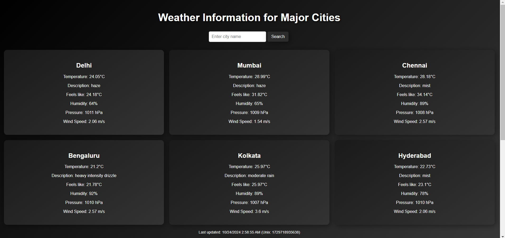
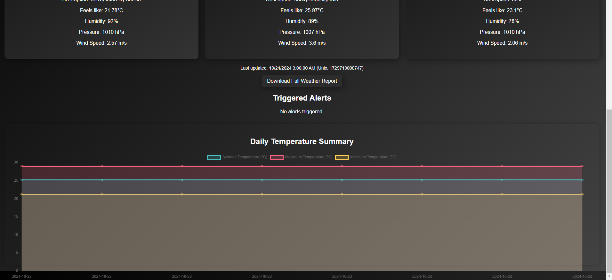

# Weather Monitoring Application

This Weather Monitoring Application fetches real-time weather data from the OpenWeatherMap API for selected cities. It displays weather information, calculates daily temperature summaries, triggers alerts for specific temperature thresholds, and provides a visual representation of the weather trends.

## Features

- **Real-Time Weather Data**: Fetches and displays current weather data for multiple cities.
- **Custom City Search**: Add any city to monitor its weather.
- **Daily Summaries**: Calculates daily average, maximum, and minimum temperatures.
- **Temperature Alerts**: Notifies when the temperature exceeds a set threshold or falls below 0°C.
- **Chart Visualization**: Provides a graphical summary of the temperature trends.
- **Download Weather Report**: Download a JSON report containing weather data, daily summaries, and triggered alerts.
- **Error Handling**: Gracefully handles errors in chart rendering.

## Prerequisites

Before running the application, ensure you have the following installed:

- [Node.js](https://nodejs.org/) (v14 or higher)
- [npm](https://www.npmjs.com/) (Node Package Manager)

## Installation

Follow the steps below to install, build, and run the application:

1. **Clone the Repository**

   ```bash
   git clone https://github.com/prachisingh25/Weather-Monitoring.git

2. **Navigate to the Project Directory**
   ```bash
   cd Weather-Monitoring

3. **Install Dependencies**
    ```bash
    cd weather-monitoring-app

4. **Set Up API Key**

   You will need an API key from OpenWeatherMap. If you don't have one, you can sign up for an account and     generate an API key here.
   Once you have the API key, replace YOUR_API_KEY in the Weather.js file with your actual API key:
    ```bash
    const apiKey = 'YOUR_API_KEY';

## Running the Application

Follow the steps below to install, build, and run the application:
    
**Start the Application**

Once the dependencies are installed and the API key is configured, you can start the application using the command:
  ```npm start```

This will start the app and automatically open it in your default web browser. If it doesn't, you can manually open http://localhost:3000 in your browser.

## Images





## Usage

- **City Search**: Enter a city name in the input field and click "Search" to add it to the monitored cities list.
- **Weather Information**: The weather data for the selected cities will be displayed as cards.
- **Triggered Alerts**: Any temperature alerts will be shown in the "Triggered Alerts" section.
- **Download Report**: Click on the "Download Full Weather Report" button to download a detailed report in JSON format.
- **Temperature Chart**: The application provides a chart visualizing the daily temperature trends.

## Technologies Used

- **React.js**: Frontend framework for building user interfaces.
- **Axios**: HTTP client for making API requests.
- **Chart.js**: Library for chart visualizations.
- **OpenWeatherMap API**: For fetching weather data.
- **Error Handling**: The application includes an `ErrorBoundary` component to handle errors in rendering the chart and displays a fallback message in case of failure.

